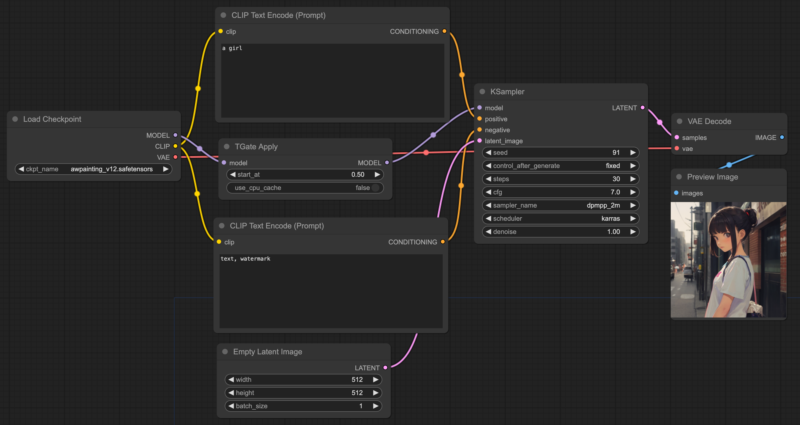

# ComfyUI_TGate

[ComfyUI](https://github.com/comfyanonymous/ComfyUI) reference implementation for [T-GATE](https://github.com/HaozheLiu-ST/T-GATE).

## Example workflows

The [examples directory](./examples/) has workflow example. There are images generated with and without T-GATE in the [assets](./assets/) folder.



Origin result


T-GATE result (start at 0.5, only_cross_attention)


## INSTALL
```bash
git clone https://github.com/JettHu/ComfyUI_TGate
git apply tgate.patch
```

## Nodes reference

### TGateApply

#### Inputs
- **model**, model loaded by `Load Checkpoint` and other MODEL loaders.

#### Optional inputs
- **model**, tgate wrapped model.

#### Configuration parameters
- **start_at**, this is the timestepping. Defines at what percentage point of the generation to start use the T-GATE cache.
- **only_cross_attention**, default only used to cache the cross-attention output, ref to [issues](https://github.com/HaozheLiu-ST/T-GATE/issues/8#issuecomment-2061379798)


#### Optional configuration
- **self_attn_start_at**, only takes effect when `only_cross_attention` is `false`, timestepping too. Defines at what percentage point of the generation to start use the T-GATE cache.

## TODO
- [x] Result image quality is inconsistent with origin. Now cache attn2 (cross_attention) only.
- [ ] Implement a native version and no longer rely on git patch
