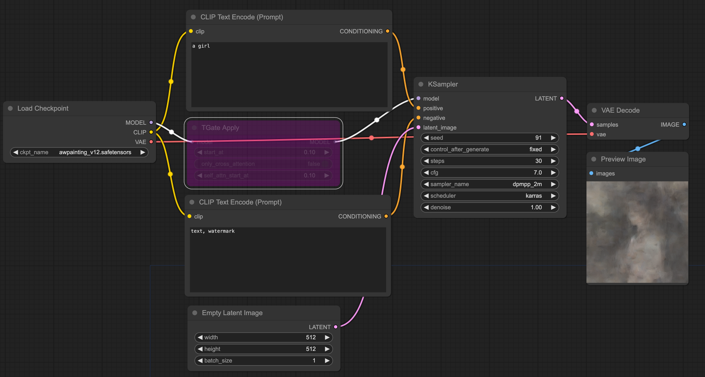
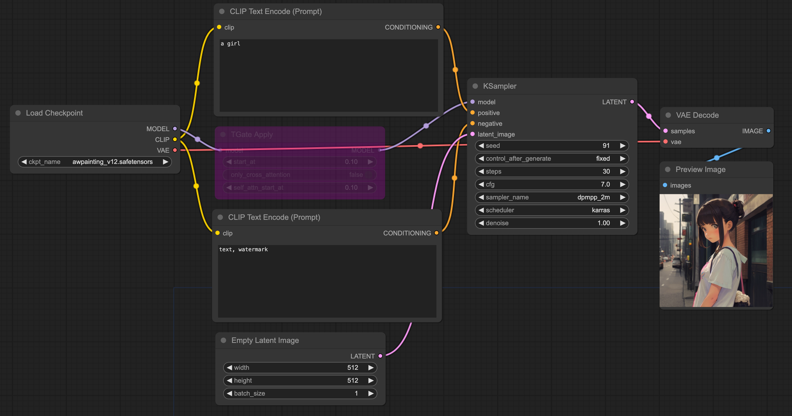

# ComfyUI_TGate

<p align="center">
<a href="./README.md">English</a> | <a href="./README.zh-CN.md">简体中文</a>
</p>

[ComfyUI](https://github.com/comfyanonymous/ComfyUI) reference implementation for [T-GATE](https://github.com/HaozheLiu-ST/T-GATE).

T-GATE could brings **10%-50% speed up** for different diffusion models, only **slightly** reduces the quality of the generated images and maintains the original composition.

> Some monkey patch is used for current implementation. If any error occurs, make sure you have the latest version.

If my work helps you, consider giving it a star. 

Some of my other projects that may help you.
- [ComfyUI-TCD](https://github.com/JettHu/ComfyUI-TCD)
- [ComfyUI_TGate](https://github.com/JettHu/ComfyUI_TGate)
- [ComfyUI-ELLA](https://github.com/TencentQQGYLab/ComfyUI-ELLA)


## :star2: Changelog
- **[2024.5.06]**: add `use_cpu_cache`, reduce some GPU OOM promblem.
- **[2024.4.30]** :wrench: Fixed an cond-only sampling bug that caused animatediff error. Thanks [pamparamm](https://github.com/pamparamm).
- **[2024.4.29]** :wrench: `TL,DR`: Improved performance and T-GATE only works where it needs to work.
  - Fixed a bug that caused `TGateApply` to affect other places where the model is used, even if `TGateApply` is turned off.
  - Fixed cross attntion results not being cached correctly causing performance to be slightly lower than the git patch version.
- **[2024.4.26]** :tada: Native version release(NO NEED git patch anymore!).
- **[2024.4.18]** Initial repo.

## :books: Example workflows

The [examples directory](./examples/) has workflow example. There are images generated with and without T-GATE in the [assets](./assets/) folder.


| Origin result | T-GATE result |
| :---: | :---: |
|  |  |

T-GATE result image comes from the workflow included in the [example](./examples/tgate_workflow_example.png) image.


### Compare to AutomaticCFG

[AutomaticCFG](https://github.com/Extraltodeus/ComfyUI-AutomaticCFG) is another ComfyUI plugin: Your CFG won't be your CFG anymore. It is turned into a way to guide the CFG/final intensity/brightness/saturation, and it adds a 30% speed increase.

> env: T4-8G

| | Origin | T-GATE 0.5 | AutomaticCFG | T-GATE 0.35 |AutomaticCFG fatest |
| :---: | :---: | :---: | :---: | :---: | :---: |
| result |  |  |  |  |  |
| speed | 4.59it/s | **5.68it/s** | 5.62it/s| **6.13it/s** | **6.13it/s** |

T-GATE performs best when maintaining the original composition. However, if you don't need to maintain composition, [AutomaticCFG fatest](https://github.com/Extraltodeus/ComfyUI-AutomaticCFG) also brings about the same performance improvement.

## :green_book: INSTALL
```bash
git clone https://github.com/JettHu/ComfyUI_TGate
# that's all!
```

## :orange_book: Major Features

- Training-Free.
- Friendly support CNN-based U-Net, Transformer, and Consistency Model
- 10%-50% speed up for different diffusion models.


## :book: Nodes reference

### TGateApply

#### Inputs
- **model**, model loaded by `Load Checkpoint` and other MODEL loaders.

#### Configuration parameters
- **start_at**, this is the percentage of steps. Defines at what percentage point of the generation to start use the T-GATE cache.
- **only_cross_attention**, **[RECOMMEND]** default is True, the effect is to cache only the output of cross-attention, ref to [issues](https://github.com/HaozheLiu-ST/T-GATE/issues/8#issuecomment-2061379798)
- **use_cpu_cache**>: If multiple batches (animatediff) cause GPU OOM, you can set it to true, and T-GATE performance will decrease.

#### Optional configuration
- **self_attn_start_at**, only takes effect when `only_cross_attention` is `false`, percentage of steps too. Defines at what percentage point of the generation to start use the T-GATE cache on latent self attnention.

## :rocket: Performance (from [T-GATE](https://github.com/HaozheLiu-ST/T-GATE))
| Model                 | MACs     | Param     | Latency | Zero-shot 10K-FID on MS-COCO |
|-----------------------|----------|-----------|---------|---------------------------|
| SD-1.5                | 16.938T  | 859.520M  | 7.032s  | 23.927                    |
| SD-1.5 w/ TGATE       | 9.875T   | 815.557M  | 4.313s  | 20.789                    |
| SD-2.1                | 38.041T  | 865.785M  | 16.121s | 22.609                    |
| SD-2.1 w/ TGATE       | 22.208T  | 815.433 M | 9.878s  | 19.940                    |
| SD-XL                 | 149.438T | 2.570B    | 53.187s | 24.628                    |
| SD-XL w/ TGATE        | 84.438T  | 2.024B    | 27.932s | 22.738                    |
| Pixart-Alpha          | 107.031T | 611.350M  | 61.502s | 38.669                    |
| Pixart-Alpha w/ TGATE | 65.318T  | 462.585M  | 37.867s | 35.825                    |
| DeepCache (SD-XL)     | 57.888T  | -         | 19.931s | 23.755                    |
| DeepCache w/ TGATE    | 43.868T  | -         | 14.666s | 23.999                    |
| LCM (SD-XL)           | 11.955T  | 2.570B    | 3.805s  | 25.044                    |
| LCM w/ TGATE          | 11.171T  | 2.024B    | 3.533s  | 25.028                    |
| LCM (Pixart-Alpha)    | 8.563T   | 611.350M  | 4.733s  | 36.086                    |
| LCM w/ TGATE          | 7.623T   | 462.585M  | 4.543s  | 37.048                    |

The latency is tested on a 1080ti commercial card. 

The MACs and Params are calculated by [calflops](https://github.com/MrYxJ/calculate-flops.pytorch). 

The FID is calculated by [PytorchFID](https://github.com/mseitzer/pytorch-fid).

## :memo: TODO
- [x] Result image quality is inconsistent with origin. Now cache attn2 (cross_attention) only.
- [x] Implement a native version and no longer rely on git patch
- [ ] Fully compatible with animatediff. Currently, both plugins hook `comfy.samplers.sampling_function`, T-Gate does not perform correctly. [refer to](https://github.com/JettHu/ComfyUI_TGate/issues/10#issuecomment-2095149176)
- [ ] compatible with TiledDiffusion. [issue #11](https://github.com/JettHu/ComfyUI_TGate/issues/11)

## :mag: Common promblem

- For apple silicon users using the mps backend, torch and macos versions may cause some problems. refer to [issue comment](https://github.com/JettHu/ComfyUI_TGate/issues/4#issuecomment-2077823182).

- Fixed in 2024.4.29. Unable to properly remove T-Gate effects. The situation in the picture below is `bypass the node after apply`.

| 2024.4.26-29 | Updated on 2024.4.29 |
| :---: | :---: |
|  |  |
